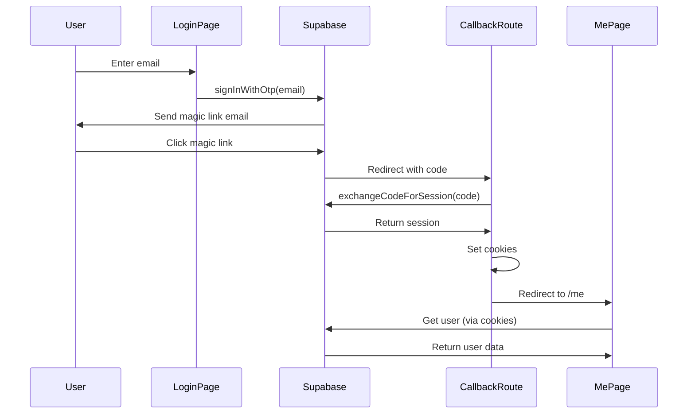
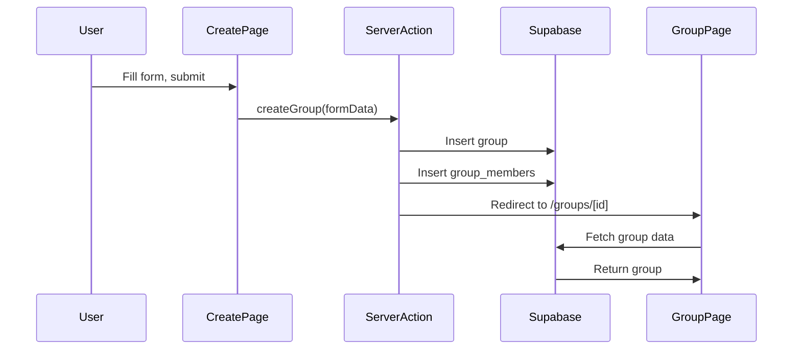
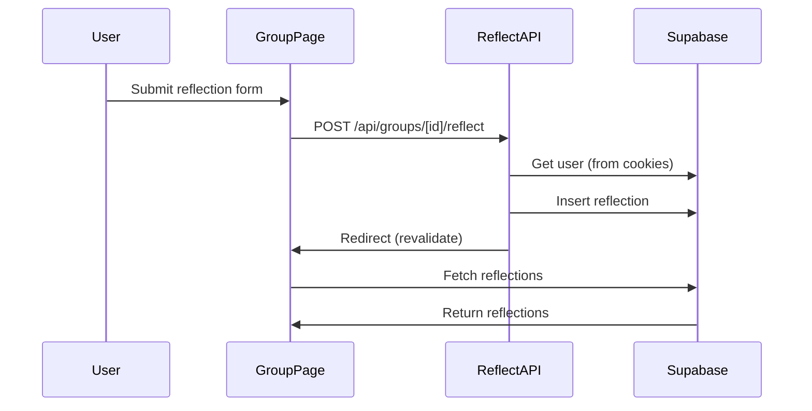

# Constellation Architecture

## Overview

Constellation is built on **Next.js App Router** with **Supabase** for authentication and database. The architecture follows a clear separation between client and server code, with specific patterns for data fetching and mutations.

---

## System Architecture

```
┌─────────────────────────────────────────────────────────────┐
│                         Browser                              │
│  ┌──────────────┐  ┌──────────────┐  ┌──────────────┐      │
│  │   Login      │  │  Groups UI   │  │ Reflections │      │
│  │  (Client)    │  │ (Server)     │  │  (Server)    │      │
│  └──────┬───────┘  └──────┬───────┘  └──────┬───────┘      │
│         │                  │                  │              │
│         │ supabaseBrowser()│                  │              │
│         └──────────────────┴──────────────────┘              │
└────────────────────────┬────────────────────────────────────┘
                         │
                         │ HTTP
                         │
┌────────────────────────▼────────────────────────────────────┐
│                    Next.js Server                           │
│                                                              │
│  ┌────────────────────────────────────────────────────┐    │
│  │           Server Components                        │    │
│  │  • Groups listing                                  │    │
│  │  • Group details                                   │    │
│  │  • Reflections display                             │    │
│  │  Uses: supabaseServer() (read-only)                │    │
│  └────────────────────────────────────────────────────┘    │
│                                                              │
│  ┌────────────────────────────────────────────────────┐    │
│  │        API Route Handlers                          │    │
│  │  • /api/groups/[id]/join                           │    │
│  │  • /api/groups/[id]/reflect                        │    │
│  │  • /api/groups/create                              │    │
│  │  Uses: supabaseServerAction() (read/write)         │    │
│  └────────────────────────────────────────────────────┘    │
│                                                              │
│  ┌────────────────────────────────────────────────────┐    │
│  │        Server Actions                              │    │
│  │  • createGroup()                                   │    │
│  │  Uses: supabaseServerAction() (read/write)         │    │
│  └────────────────────────────────────────────────────┘    │
│                                                              │
│  ┌────────────────────────────────────────────────────┐    │
│  │        Auth Callback                               │    │
│  │  • /auth/callback/route.ts                         │    │
│  │  • Exchanges code for session                      │    │
│  │  Uses: supabaseServerAction() (writes cookies)     │    │
│  └────────────────────────────────────────────────────┘    │
└────────────────────────┬────────────────────────────────────┘
                         │
                         │ HTTP/PostgreSQL
                         │
┌────────────────────────▼────────────────────────────────────┐
│                      Supabase                                │
│  ┌──────────────┐  ┌──────────────┐  ┌──────────────┐      │
│  │   Auth       │  │  Database    │  │   Storage    │      │
│  │  (Magic Link)│  │  (PostgreSQL)│  │   (Future)   │      │
│  └──────────────┘  └──────────────┘  └──────────────┘      │
└─────────────────────────────────────────────────────────────┘
```

---

## Data Flow

### Authentication Flow



### Group Creation Flow



### Reflection Submission Flow



---

## Supabase Client Decision Tree

```
Need Supabase client?
│
├─ In Client Component?
│  └─ YES → Use supabaseBrowser()
│
├─ In Server Component (reading data)?
│  └─ YES → Use supabaseServer() (read-only)
│
├─ In API Route Handler?
│  └─ YES → Use supabaseServerAction() (read/write)
│
├─ In Server Action?
│  └─ YES → Use supabaseServerAction() (read/write)
│
└─ In Auth Callback?
   └─ YES → Use supabaseServerAction() (must write cookies)
```

---

## File Organization Patterns

### Pages (Server Components)

```
app/
  └── [feature]/
      └── page.tsx          # Server Component
          ├── Fetches data with supabaseServer()
          ├── Renders UI
          └── May include Client Components for interactivity
```

### API Routes

```
app/
  └── api/
      └── [resource]/
          └── [id]/
              └── [action]/
                  └── route.ts    # API Route Handler
                      ├── Uses supabaseServerAction()
                      ├── Handles POST/PUT/DELETE
                      └── Returns NextResponse
```

### Server Actions

```
app/
  └── [feature]/
      └── actions.tsx       # Server Actions
          ├── "use server"
          ├── Uses supabaseServerAction()
          └── Exported functions for form actions
```

---

## Database Relationships

```
┌─────────────┐
│   profiles  │
│─────────────│
│ id (PK)     │◄────┐
│ email       │     │
│ created_at  │     │
└─────────────┘     │
                    │
                    │ creator_id
                    │
┌─────────────┐     │
│   groups    │     │
│─────────────│     │
│ id (PK)     │     │
│ name        │     │
│ description │     │
│ creator_id  │─────┘
└──────┬──────┘
       │
       │ group_id
       │
       ├─────────────────┐
       │                 │
┌──────▼──────┐  ┌───────▼────────┐
│group_members│  │  reflections   │
│─────────────│  │────────────────│
│ group_id    │  │ id (PK)        │
│ user_id     │  │ group_id       │
│ (composite) │  │ user_id        │
└──────┬──────┘  │ content        │
       │         │ created_at     │
       │         └────────────────┘
       │
       │ user_id
       │
┌──────▼──────┐
│  profiles   │
└─────────────┘
```

---

## Security Model

### Row Level Security (RLS)

- **profiles**: Users can read their own profile
- **groups**: Public read, creator can update/delete
- **group_members**: Users can read members of groups they're in
- **reflections**: Users can read reflections in groups they're members of, can create their own

### Authentication

- Session stored in HTTP-only cookies
- Cookies managed by Supabase SSR client
- Server-side session validation on every request
- No client-side session tokens exposed

---

## Key Design Decisions

### 1. Why Two Server Clients?

**Problem**: Next.js App Router has different contexts:
- Server Components can't write cookies
- API Routes can write cookies

**Solution**: Two clients with different cookie handlers:
- `supabaseServer()` - Read-only for Server Components
- `supabaseServerAction()` - Read/write for API Routes

### 2. Why API Routes for Mutations?

**Reason**: 
- Clear separation of concerns
- Better error handling
- Easier to add middleware
- Consistent with REST patterns

### 3. Why Server Components for Data Fetching?

**Reason**:
- Automatic SSR
- No loading states needed
- Better SEO
- Reduced client bundle size

### 4. Why Magic Links?

**Reason**:
- Passwordless = better UX
- No password storage = better security
- Supabase handles email delivery
- PKCE flow for security

---

## Performance Considerations

### Caching Strategy

- Server Components are cached by default
- Use `revalidatePath()` after mutations
- API routes are not cached (dynamic)

### Database Queries

- Use `.select()` to limit fields
- Join related data when needed (e.g., reflections with user emails)
- Index foreign keys for performance

### Bundle Size

- Server Components don't add to client bundle
- Client Components only for interactive UI
- shadcn/ui components are tree-shakeable

---

## Future Architecture Considerations

### Potential Additions

1. **Real-time subscriptions** - Use Supabase Realtime for live reflection updates
2. **File uploads** - Use Supabase Storage for reflection attachments
3. **Email notifications** - Use Supabase Edge Functions or external service
4. **Analytics** - Server-side tracking with Supabase
5. **Caching layer** - Redis for frequently accessed data

### Scalability

- Current architecture scales horizontally (stateless server)
- Database connection pooling via Supabase
- CDN for static assets (Vercel)
- Edge functions for global distribution (future)

---

## Troubleshooting Guide

### Issue: "Cookies can only be modified..."

**Check**: Are you using `supabaseServer()` in an API route?  
**Fix**: Switch to `supabaseServerAction()`

### Issue: "Missing tokens in callback"

**Check**: Is callback at `/auth/callback/page.tsx`?  
**Fix**: Move to `/auth/callback/route.ts`

### Issue: User not authenticated in Server Component

**Check**: Are you awaiting `supabaseServer()`?  
**Fix**: `const supabase = await supabaseServer();`

### Issue: Params undefined in dynamic route

**Check**: Are you awaiting params? (Next.js 15+)  
**Fix**: `const { id } = await params;`

---

**For more details, see [CONTEXT.md](./CONTEXT.md)**

